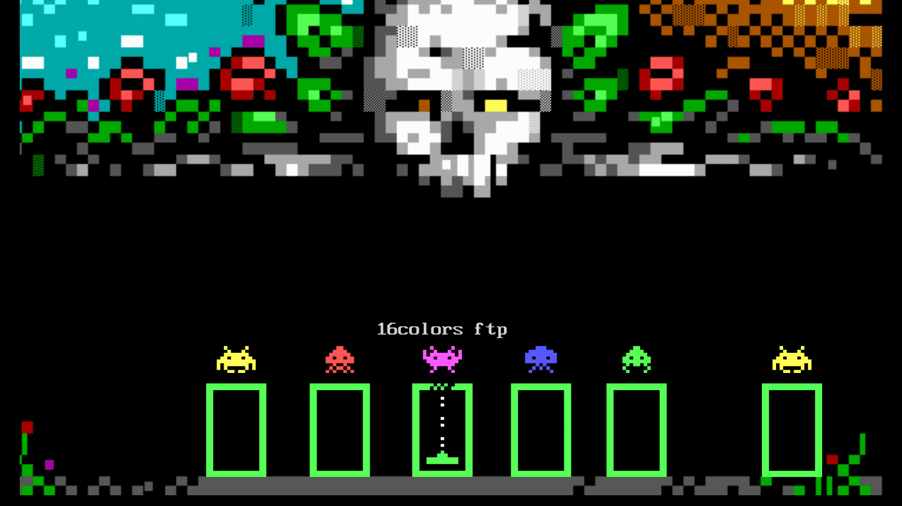

# ANSi View (PS3)

[![Downloads][img_downloads]][app_downloads] [![Release][img_latest]][app_latest] [![License][img_license]][app_license]

**ANSi View** is an application to view ANSi and artscene related file formats on the PlayStation 3.

The `ansiview-ps3` homebrew app supports viewing ANS/PCB/BIN/ADF/IDF/TND/XB/ASC/NFO/DIZ files directly on your PS3.

**Comments, ideas, suggestions?** You can contact [me](https://github.com/bucanero/) on [Twitter](https://twitter.com/dparrino) and on [my website](http://www.bucanero.com.ar/).

# Features

# Download

Get the [latest version here][app_latest].

### Changelog

See the [latest changes here](CHANGELOG.md).

# Setup instructions

No special setup is needed. Just download the latest `ansiview-ps3.pkg` package and install it on your PlayStation 3.

# Usage

Using the application is simple and straight-forward: 

 - Move **UP/DOWN** to select the ANSi art file you want to view, and press . The selected image will scroll on the screen.
 - To see the item's SAUCE details, press .
It will open the context menu on the screen. Press  to return to the list.
 - To reload the folder list, press .
 - Press left **(L1/L2)** or right trigger buttons **(R1/R2)** to move pages up or down.

## Notes

- **USB art packs:** your folders must be placed on `/dev_usb000/ANSIVIEW/` or `/dev_usb001/ANSIVIEW/`.
- **HDD art packs:** folders will be scanned from `/dev_hdd0/game/NP0ANSIVW/USRDIR/DATA/`.

# 16colors Artscene database

The application provides direct access to the [16colors database](https://16colo.rs) of artscene files. You can browse their entire art collection (1990 - 2020) if your PS3 has a network connection available.

**Note:** Downloaded art files are cached on `/dev_hdd0/game/NP0ANSIVW/USRDIR/CACHE/`.

# Credits

* [Bucanero](http://www.bucanero.com.ar/): Project developer
* [Dnawrkshp](https://github.com/Dnawrkshp/): [Artemis PS3](https://github.com/Dnawrkshp/ArtemisPS3)
* [ByteProject](https://github.com/ByteProject)/[bricas](https://github.com/bricas)/[fcambus](https://github.com/fcambus): [libansilove](https://github.com/ansilove/libansilove)

# Building

You need to have installed:

- [PS3 toolchain](https://github.com/bucanero/ps3toolchain)
- [PSL1GHT](https://github.com/bucanero/PSL1GHT) SDK
- [libansilove](https://github.com/bucanero/libansilove) library (my own custom version)
- [Tiny3D](https://github.com/Estwald/PSDK3v2/tree/master/libraries-src/Tiny3D) library (from Estwald)
- [libcurl](https://github.com/ps3dev/ps3libraries/blob/master/scripts/016-libcurl-7.31.0.sh) library
- [dbglogger lib](https://github.com/bucanero/psl1ght-libs/tree/master/dbglogger) (my own debug logging library)

Run `make` to create a release build. After that, run `make pkg` to create a `.pkg` install file. 

You can also set the `PS3LOAD` environment variable to the PS3 IP address: `export PS3LOAD=tcp:x.x.x.x`.
This will allow you to use `make run` and send `ansiview-ps3.self` directly to the PS3Load listener.

To enable debug logging, build ANSi View with `make DEBUGLOG=1`. The application will send debug messages to
UDP multicast address `239.255.0.100:30000`. To receive them you can use [socat][] on your computer:

    $ socat udp4-recv:30000,ip-add-membership=239.255.0.100:0.0.0.0 -

# License

`ansiview-ps3` is released under the [MIT License](LICENSE).

[PSDLE]: https://repod.github.io/psdle/
[socat]: http://www.dest-unreach.org/socat/
[app_downloads]: https://github.com/bucanero/ansiview-ps3/releases
[app_latest]: https://github.com/bucanero/ansiview-ps3/releases/latest
[app_license]: https://github.com/bucanero/ansiview-ps3/blob/master/LICENSE
[img_downloads]: https://img.shields.io/github/downloads/bucanero/ansiview-ps3/total.svg?maxAge=3600
[img_latest]: https://img.shields.io/github/release/bucanero/ansiview-ps3.svg?maxAge=3600
[img_license]: https://img.shields.io/github/license/bucanero/ansiview-ps3.svg?maxAge=2592000
